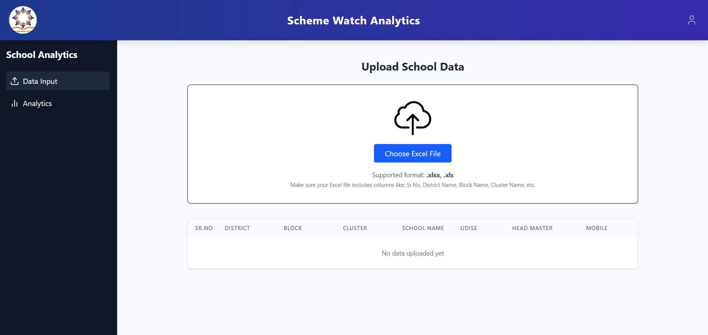
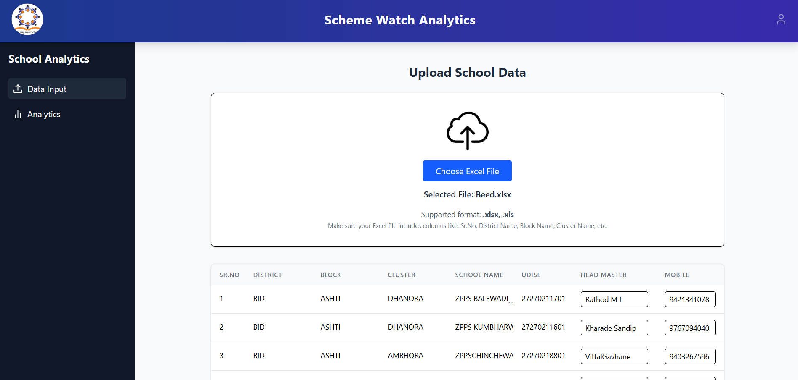
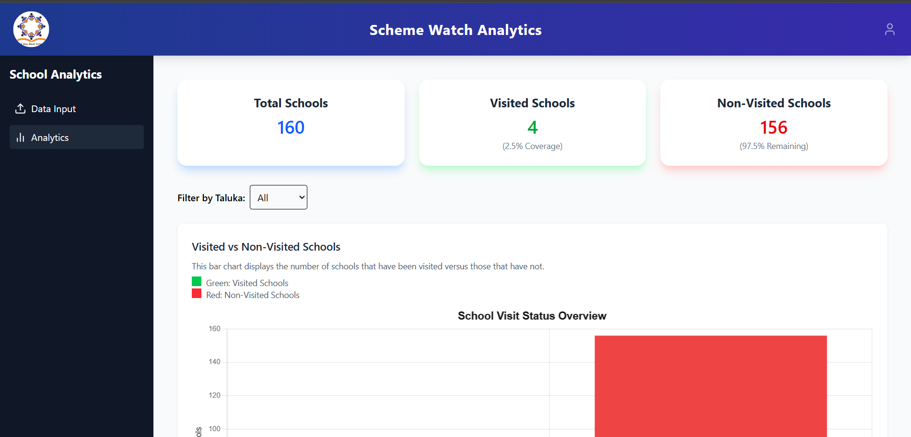
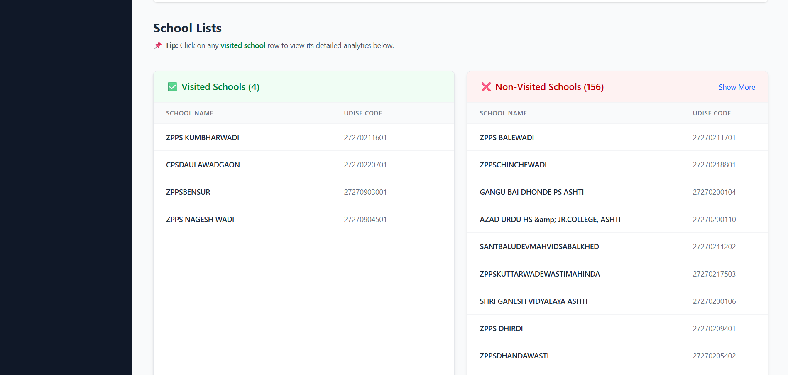
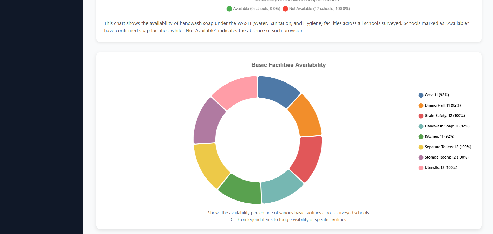

# React + Vite

# 🏫 Scheme Watch Analytics

Scheme Watch Analytics is a comprehensive web-based dashboard that tracks and analyzes school visit data related to the Mid-Day Meal (MDM) scheme. The app enables administrators to upload school data, monitor visit status, and view insightful analytics using various interactive charts.

 

---

## 🚀 Features

- 📥 **CSV Upload**: Upload school-wise survey or visit data from Excel/CSV files.
- 🏫 **School Categorization**: Automatically classifies schools as **Visited** or **Non-Visited**.
- 📊 **Analytics Dashboard**:
  - Overall and taluka-wise statistics
  - Graphs: Pie, Bar, Stacked Bar, Line, Histogram, Donut
- 🔍 **School-wise Drilldown**: Click on any visited school to view detailed grant & facility analytics.
- 🧮 **Dynamic Chart Filters**: Filter graphs by Taluka and academic year.
- 📄 **PDF Reports** *(optional – add if implemented)*

---

## 📷 Screenshots

### Dashboard Overview




### School-Wise Analytics





---

## 🛠️ Tech Stack

| Tech | Description |
|------|-------------|
| **vite.js** | React framework for frontend and routing |
| **Firebase (Firestore)** | Realtime NoSQL database for storing school data |
| **Chart.js** | Used for rendering beautiful and customizable graphs |
| **Tailwind CSS** | Utility-first CSS framework for fast and responsive UI |
| **Node.js (via Next.js API routes)** | Server-side APIs (if applicable) |
| **PostgreSQL** *(optional if using hybrid backend)* | Structured data storage (if applicable) |

---

## 🧑‍💻 How to Use

1. **Clone the Repository**
   ```bash
   git clone https://github.com/yourusername/scheme-watch.git
   cd scheme-watch
